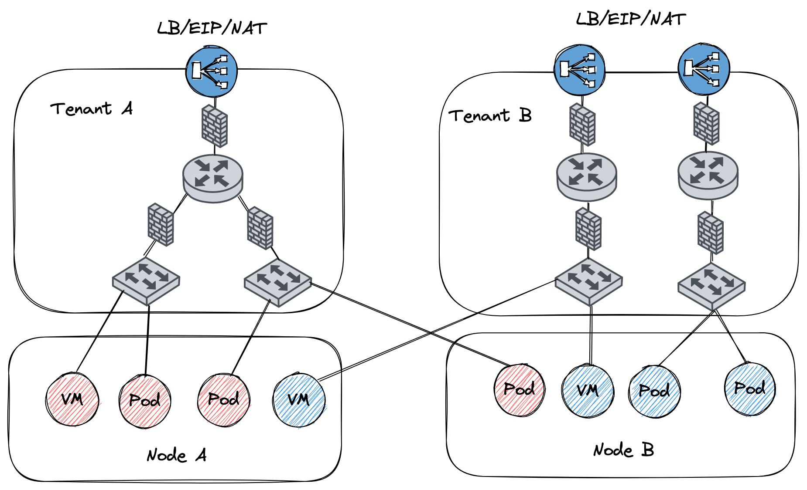

[中文文档](https://kubeovn.github.io/docs/)

If you miss the good old days of SDN, then Kube-OVN is your choice in Cloud Native era.

Kube-OVN, a [CNCF Sandbox Level Project](https://www.cncf.io/sandbox-projects/), integrates the OVN-based Network Virtualization with Kubernetes. 
It offers an advanced Container Network Fabric for Enterprises with the most functions, extreme performance and the easiest operation.

## Community
The Kube-OVN community is waiting for your participation!
- Follow us at [Twitter](https://twitter.com/KubeOvn)
- Chat with us at [Slack](https://communityinviter.com/apps/kube-ovn/kube-ovn)
- 微信用户请[填写表单](https://jinshuju.net/f/lyrEow)加入交流群！

## Features
- **Namespaced Subnets**: Each Namespace can have a unique Subnet (backed by a Logical Switch). Pods within the Namespace will have IP addresses allocated from the Subnet. It's also possible for multiple Namespaces to share a Subnet.
- **Vlan/Underlay Support**: In addition to overlay network, Kube-OVN also supports underlay and vlan mode network for better performance and direct connectivity with physical network.
- **VPC Support**: Multi-tenant network with independent address spaces, where each tenant has its own network infrastructure such as eips, nat gateways, security groups and loadbalancers.
- **Static IP Addresses for Workloads**: Allocate random or static IP addresses to workloads.
- **Multi-Cluster Network**: Connect different Kubernetes/Openstack clusters into one L3 network.
- **TroubleShooting Tools**: Handy tools to diagnose, trace, monitor and dump container network traffic to help troubleshoot complicate network issues.
- **Prometheus & Grafana Integration**: Exposing network quality metrics like pod/node/service/dns connectivity/latency in Prometheus format.
- **ARM Support**: Kube-OVN can run on x86_64 and arm64 platforms.
- **Windows Support**: Kube-OVN can run on Windows worker nodes.
- **Subnet Isolation**: Can configure a Subnet to deny any traffic from source IP addresses not within the same Subnet. Can whitelist specific IP addresses and IP ranges.
- **Network Policy**: Implementing networking.k8s.io/NetworkPolicy API by high performance ovn ACL.
- **DualStack IP Support**: Pod can run in IPv4-Only/IPv6-Only/DualStack mode.
- **Pod NAT and EIP**: Manage the pod external traffic and external ip like tradition VM.
- **IPAM for Multi NIC**: A cluster-wide IPAM for CNI plugins other than Kube-OVN, such as macvlan/vlan/host-device to take advantage of subnet and static ip allocation functions in Kube-OVN.
- **Dynamic QoS**: Configure Pod/Gateway Ingress/Egress traffic rate/priority/loss/latency on the fly.
- **Embedded Load Balancers**: Replace kube-proxy with the OVN embedded high performance distributed L2 Load Balancer.
- **Distributed Gateways**: Every Node can act as a Gateway to provide external network connectivity.
- **Namespaced Gateways**: Every Namespace can have a dedicated Gateway for Egress traffic.
- **Direct External Connectivity**：Pod IP can be exposed to external network directly.
- **BGP Support**: Pod/Subnet IP can be exposed to external by BGP router protocol.
- **Traffic Mirror**: Duplicated container network traffic for monitoring, diagnosing and replay.
- **Hardware Offload**: Boost network performance and save CPU resource by offloading OVS flow table to hardware.
- **DPDK Support**: DPDK application now can run in Pod with OVS-DPDK.
- **Cilium Integration**: Cilium can take over the work of kube-proxy.
- **F5 CES Integration**: F5 can help better manage the outgoing traffic of k8s pod/container.

## Network Topology

The Switch, Router and Firewall showed in the diagram below are all distributed on all Nodes. There is no single point of failure for in-cluster network.

## Monitoring Dashboard

Kube-OVN offers prometheus integration with grafana dashboards to visualize network quality.

## Quick Start
Kube-OVN is easy to install with all necessary components/dependencies included. If you already have a Kubernetes cluster without any cni plugin, please refer to the [Installation Guide](https://kubeovn.github.io/docs/stable/en/start/one-step-install/).

If you want to install Kubernetes from scratch, you can try [kubespray](https://github.com/kubernetes-sigs/kubespray/blob/master/docs/kube-ovn.md) or for Chinese users try [kubeasz](https://github.com/easzlab/kubeasz/blob/master/docs/setup/network-plugin/kube-ovn.md) to deploy a production ready Kubernetes cluster with Kube-OVN embedded.

## Documents

- [Overview](https://kubeovn.github.io/docs/en/)
- [Getting Start](https://kubeovn.github.io/docs/en/start/prepare/)
- [User Guide](https://kubeovn.github.io/docs/en/guide/setup-options/)
- [Operations](https://kubeovn.github.io/docs/en/ops/kubectl-ko/)
- [Advanced Usage](https://kubeovn.github.io/docs/en/advance/multi-nic/)
- [Reference](https://kubeovn.github.io/docs/en/reference/architecture/)

## Contribution
We are looking forward to your PR!

- [Development Guide](https://kubeovn.github.io/docs/en/reference/dev-env/)
- [Architecture Guide](https://kubeovn.github.io/docs/en/reference/architecture/)

## FAQ
0. Q: What's the different with other CNIs?
   
   A: Different CNI Implementations have different scopes, there is no single implementation that can resolve all network problems. Kube-OVN is aiming to bring SDN to Cloud Native. 
      If you are missing the old day network concepts like VPC, Subnet, customize route, security groups etc. you can not find corresponding functions in any other CNIs. Then Kube-OVN
      is your only choice when you need these functions to build datacenter or enterprise network fabric.

2. Q: How about the scalability of Kube-OVN?

   A: We have simulated 200 Nodes with 10k Pods by kubemark, and it works fine. Some community users have deployed one cluster with 500 Nodes and 10k+ Pods in production. It's still not reach the limitation, but we don't have enough resources to find the limitation.

3. Q: What's the Addressing/IPAM? Node-specific or cluster-wide?

   A: Kube-OVN uses a cluster-wide IPAM, Pod address can float to any nodes in the cluster.

4. Q: What's the encapsulation?

   A: For overlay mode, Kube-OVN uses Geneve/Vxlan/STT to encapsulate packets between nodes. For Vlan/Underlay mode there is no encapsulation.

